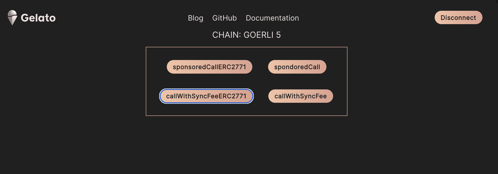

# Relay Examples

This project showcases the implementation of the relay sdk v5 with front end (React) and back end (node) examples.
The relay sdk implements ethers v6 that introduces some minor breaking changes when instantiating the providers and creating the payload data. Please refer to the [ethers migration guide](https://docs.ethers.org/v6/migrating/) for further information


## Frontend examples

We are using React to showcase the relay-sdk integration  

Please add the Gelat Relay sponsorsKey [here](src/components/App/index.tsx#L22) 

```
yarn start
```



The implementation code can be found here:
- [sponsoredCallERC2771](src/components/App/index.tsx#L102). Link to [docs](https://docs.gelato.network/developer-services/relay/erc-2771-recommended/sponsoredcallerc2771). 
- [sponsoredCall](src/components/App/index.tsx#L136). Link to  [docs](https://docs.gelato.network/developer-services/relay/non-erc-2771/sponsoredcall). 
- [callWithSyncFee](src/components/App/index.tsx#L164). Link to  [docs](https://docs.gelato.network/developer-services/relay/non-erc-2771/callwithsyncfee). 
- [callWithSyncFeeERC2771](src/components/App/index.tsx#L194). Link to   [docs](https://docs.gelato.network/developer-services/relay/erc-2771-recommended/callwithsyncfeeerc2771). 


## Backend/Node examples

Please copy `.env.example` to `.env ` and add the GELATO_RELAY_API_KEY, PRIVATE_KEY and ROOTSTOCK_ID. Then you can run:

### sponsoredCallERC2771
```
yarn testSponsoredCallERC2771
```
code can be found [here](scripts/testSponsoredCallERC2771.ts) and here the [docs](https://docs.gelato.network/developer-services/relay/erc-2771-recommended/sponsoredcallerc2771) 

### sponsoredCall
```
yarn testSponsoredCall
```
code can be found [here](scripts/testSponsoredCall.ts) and here the [docs](https://docs.gelato.network/developer-services/relay/non-erc-2771/sponsoredcall) 


### callWithSyncFee
```
yarn testCallWithSyncFee
```
code can be found [here](scripts/testCallWithSyncFee.ts) and here the [docs](https://docs.gelato.network/developer-services/relay/non-erc-2771/callwithsyncfee) 


### callWithSyncFeeERC2771
```
yarn testCallWithSyncFeeERC2771
```
code can be found [here](scripts/testCallWithSyncFeeERC2771.ts) and here the [docs](https://docs.gelato.network/developer-services/relay/erc-2771-recommended/callwithsyncfeeerc2771) 


### concurrentSponsoredCallERC2771
```
yarn testConcurrentSponsoredCallERC2771
```
code can be found [here](scripts/testConcurrentSponsoredCallERC2771.ts) and here the [docs](https://docs.gelato.network/developer-services/relay/erc-2771-recommended/sponsoredcallerc2771#parameters-for-concurrent-requests) 


### getSignatureDataERC2771 with sponsoredCallERC2771WithSignature
```
yarn testSponsoredCallERC2771WithSignature
```
code can be found [here](scripts/testSponsoredCallERC2771WithSignature.ts) and here the [docs](https://docs.gelato.network/developer-services/relay/erc-2771-recommended/sponsoredcallerc2771#getdatatosignerc2771) 


### getDataToSignERC2771 with sponsoredCallERC2771WithSignature
```
yarn testSponsoredGetDataToSignERC2771
```
code can be found [here](scripts/testSponsoredGetDataToSignERC2771.ts) and here the [docs](https://docs.gelato.network/developer-services/relay/erc-2771-recommended/sponsoredcallerc2771#getdatatosignerc2771) 


### getSignatureDataERC2771 with callWithSyncFeeERC2771WithSignature
```
yarn testCallWithSyncFeeERC2771WithSignature
```
code can be found [here](scripts/testCallWithSyncFeeERC2771WithSignature.ts) and here the [docs](https://docs.gelato.network/developer-services/relay/erc-2771-recommended/callwithsyncfeeerc2771#getsignaturedataerc2771) 


### getDataToSignERC2771 with callWithSyncFeeERC2771WithSignature
```
yarn testCallWithSyncFeeGetDataToSignERC2771
```
code can be found [here](scripts/testCallWithSyncFeeGetDataToSignERC2771.ts)  and here the [docs]( and here the [docs](https://docs.gelato.network/developer-services/relay/erc-2771-recommended/callwithsyncfeeerc2771#getsignaturedataerc2771) 
) 


## Tracking your Relay Request

### WebSocket Subscription

Docs can be found [here](https://docs.gelato.network/developer-services/relay/tracking-your-relay-request#websocket-subscriptions)

[Relay-sdk Implementation](src/components/App/index.tsx#L121) 
```typescript
    relay.onTaskStatusUpdate((taskStatus: TransactionStatusResponse) => {
      console.log("Task status update", taskStatus);
      fetchStatusSocket(taskStatus, setMessage, setLoading);
    });
```

[Websocket API](src/components/App/index.tsx#L161)
```typescript
 const relayStatusWs = new WebSocket(
      "wss://api.gelato.digital/tasks/ws/status"
    );
      relayStatusWs.onopen = (event) => {
        relayStatusWs.send(
          JSON.stringify({
            action: "subscribe" as string,
            taskId: response.taskId,
          })
        );
        relayStatusWs.onmessage = (event) => {
          fetchStatusSocket(JSON.parse(event.data).payload, setMessage, setLoading);
        };
      }
```

### Polling for Updates
Docs can be found [here](https://docs.gelato.network/developer-services/relay/tracking-your-relay-request#polling-for-updates)

[code](src/components/App/task.ts#L27)

```typescript
let status = await relay.getTaskStatus(taskIdToQuery);`
```

### Status
Docs can be found [here](https://docs.gelato.network/developer-services/relay/tracking-your-relay-request#task-status-response)
```typescript
 let details = {
        txHash: status?.transactionHash || undefined,
        chainId: status?.chainId?.toString() || undefined,
        blockNumber: status?.blockNumber?.toString() || undefined,
        executionDate: status?.executionDate || undefined,
        creationnDate: status?.creationDate || undefined,
        taskState: (status?.taskState as TaskState) || undefined,
      };
      let body = ``;
      let header = ``;

      let txHash = details.txHash;

      switch (details.taskState!) {
        case TaskState.WaitingForConfirmation:
          header = `Transaction Relayed`;
          body = `Waiting for Confirmation`;
          break;
        case TaskState.Pending:
          header = `Transaction Relayed`;
          body = `Pending Status`;

          break;
        case TaskState.CheckPending:
          header = `Transaction Relayed`;
          body = `Simulating Transaction`;

          break;
        case TaskState.ExecPending:
          header = `Transaction Relayed`;
          body = `Pending Execution`;
          break;
        case TaskState.ExecSuccess:
          header = `Transaction Executed`;
          body = `Waiting to refresh...`;

          destroyFetchTask.next();
          setTimeout(() => {
            console.log("finish");
            setLoading(false);
          }, 2000);

          break;
        case TaskState.Cancelled:
          header = `Canceled`;
          body = `TxHash: ${details.txHash}`;
          destroyFetchTask.next();
          break;
        case TaskState.ExecReverted:
          header = `Reverted`;
          body = `TxHash: ${details.txHash}`;
          destroyFetchTask.next();
          break;
        case TaskState.NotFound:
          header = `Not Found`;
          body = `TxHash: ${details.txHash}`;
          destroyFetchTask.next();
          break;
        case TaskState.Blacklisted:
          header = `BlackListed`;
          body = `TxHash: ${details.txHash}`;
          destroyFetchTask.next();
          break;
        default:
          break;
      }
```